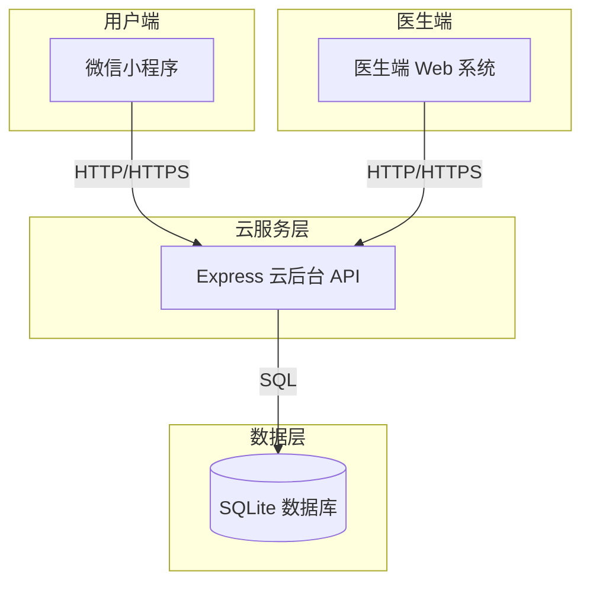
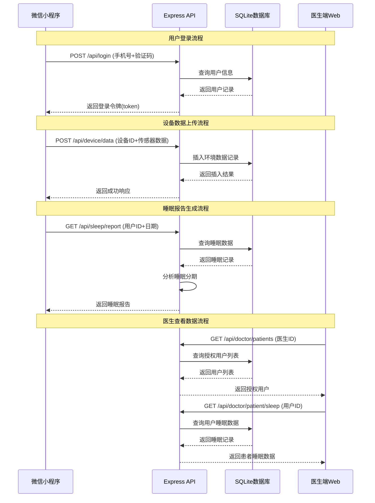

# 系统架构图

## 系统总体架构

## 模块说明

### 1. 微信小程序（用户端）
- 用户登录与注册（手机号/微信授权）
- 虚拟设备管理（添加、编辑、删除设备）
- 睡眠数据展示（睡眠报告、分期分析）
- 环境监测（温度、湿度、噪音曲线）
- 个性化建议与作息管理

### 2. Express 云后台 API
- 身份认证与授权管理
- 设备数据接收与存储
- 睡眠数据分析与处理
- RESTful API 接口服务
- 医生授权数据共享

### 3. SQLite 数据库
- 用户信息表（用户ID、手机号、昵称、头像）
- 设备信息表（设备ID、用户ID、设备类型、状态）
- 睡眠数据表（记录ID、用户ID、睡眠时段、分期数据）
- 环境数据表（记录ID、设备ID、温度、湿度、噪音）
- 医生授权表（授权ID、用户ID、医生ID、授权状态）

### 4. 医生端 Web 系统
- 医生登录与身份验证
- 授权用户列表管理
- 用户睡眠数据查看
- 诊疗建议记录

## 数据流向说明

## 架构特点

1. **分层架构**：清晰的三层架构（表现层、服务层、数据层），职责分离
2. **松耦合**：各模块通过API接口交互，便于独立开发和部署
3. **安全性**：基于令牌的身份认证，支持医生授权机制
4. **轻量级**：使用SQLite数据库，适合轻量级部署场景
5. **扩展性**：RESTful API设计，便于后续扩展新功能模块
